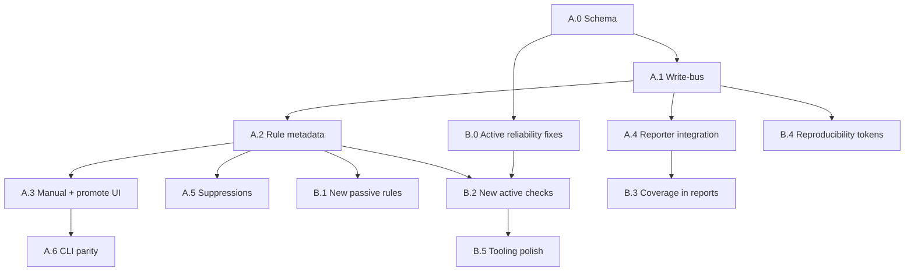

# Findings & Scanner — Implementation Plan

> **Status:** planning. Authored 2026-06-09.
> **Reference doc — read this first** before touching `reqlore/scanner/`, `reqlore/storage/__init__.py` issues-related code, or anything that calls `project.add_finding`.

This document is the single source of truth for closing two gaps:

1. **The findings ledger is not unified.** Only the passive and active scanners can write to the `issues` table. Intruder, smuggling, sequencer, SAML decoder, OAST, GraphQL, proxy interception and the operator's own observations are invisible to the Reporter.
2. **The scanner coverage is shallow.** ~11 passive rules and ~9 active checks. Whole vulnerability classes (XXE, path traversal, NoSQLi, DOM XSS, deserialisation, …) are absent. There is no rule metadata, no per-(rule, asset) FP suppression, no "why I didn't fire" output, no reproducibility token.

The plan is split into **two tracks** that proceed in parallel but never block each other:

- **Track A — Unified findings ledger** (architectural; foundational).
- **Track B — Scanner coverage & quality** (rule additions + engine quality).

Each track is split into **phases**. Each phase has: goal, exact file list, function signatures, schema migrations, tests to add, acceptance criteria, and "watch out for" notes.

---

## 0. Ground rules (apply to every phase)

| Rule | Why |
|---|---|
| **Never edit a file before reading it.** Use `read_file` on the full target range, then `replace_string_in_file`. | Avoid mojibake / context drift. |
| **Never use `Get-Content` / `Set-Content` on non-ASCII source files** (cp1252 → UTF-8-BOM mojibake on PS 5.1). Use the editor tools. | Documented in user memory. |
| **Run tests after every phase**: `py -m pytest reqlore/tests/unit/ -x --tb=short`. No new code lands red. | Catches regressions early. |
| **Every new public function gets a unit test in the same phase.** | No code without a test. |
| **One SQLite migration per phase, idempotent (`CREATE TABLE IF NOT EXISTS`, `ALTER TABLE … ADD COLUMN` guarded by `PRAGMA table_info`).** | Re-running the install must be safe. |
| **No new top-level dependencies without an optional-extra in `pyproject.toml`.** Wrap imports in `try/except ImportError` with an `XXX_AVAILABLE` flag. | Mirror the `python-docx` pattern. |
| **No emojis in code, docs, or templates. No multi-line code comments. Type hints on new public API only.** | Project convention. |
| **Run command prefix on terminals: `cd D:\TechBooks\reqlore;`.** | Some terminals lose cwd. |
| **Update this document at the end of every phase** with a `### YYYY-MM-DD — Phase X done` block (mirror the Intruder phase log style). | Keeps the plan honest. |

---

# Track A — Unified findings ledger

## A.0 Schema upgrade (foundation for everything else)

**Goal:** make the `issues` table able to hold richer findings + provenance + suppression + reproducibility, without breaking existing rows.

**Files:**
- [reqlore/storage/__init__.py](../reqlore/storage/__init__.py) — schema and DAL.
- [reqlore/tests/unit/test_storage_phase2.py](../reqlore/tests/unit/test_storage_phase2.py) — extend.
- New: `reqlore/tests/unit/test_findings_schema.py`.

**Schema migration** (idempotent, add at the end of `_SCHEMA_SQL` plus a `_migrate()` step in `_ensure_schema`):

```sql
ALTER TABLE issues ADD COLUMN uuid TEXT;                       -- stable across DB compaction
ALTER TABLE issues ADD COLUMN source TEXT NOT NULL DEFAULT 'scanner';
                                                                -- scanner|intruder|smuggling|
                                                                -- sequencer|saml|graphql|oast|
                                                                -- proxy|manual|plugin|imported
ALTER TABLE issues ADD COLUMN rule_id TEXT;                    -- e.g. "passive:hsts-missing"
ALTER TABLE issues ADD COLUMN rule_version INTEGER;            -- bump when rule logic changes
ALTER TABLE issues ADD COLUMN description TEXT NOT NULL DEFAULT '';
ALTER TABLE issues ADD COLUMN remediation TEXT NOT NULL DEFAULT '';
ALTER TABLE issues ADD COLUMN references_json TEXT;            -- JSON array of strings
ALTER TABLE issues ADD COLUMN cvss_vector TEXT;
ALTER TABLE issues ADD COLUMN cvss_score REAL;
ALTER TABLE issues ADD COLUMN reproduction_token TEXT;         -- opaque key into reproductions
ALTER TABLE issues ADD COLUMN updated_at INTEGER;

CREATE TABLE IF NOT EXISTS finding_targets (
    finding_id INTEGER NOT NULL REFERENCES issues(id) ON DELETE CASCADE,
    host TEXT NOT NULL,
    url TEXT NOT NULL,
    PRIMARY KEY (finding_id, host, url)
);

CREATE TABLE IF NOT EXISTS finding_suppressions (
    rule_id TEXT NOT NULL,
    host TEXT NOT NULL DEFAULT '',
    url_pattern TEXT NOT NULL DEFAULT '',
    reason TEXT NOT NULL DEFAULT '',
    created_at INTEGER NOT NULL,
    PRIMARY KEY (rule_id, host, url_pattern)
);

CREATE TABLE IF NOT EXISTS finding_reproductions (
    token TEXT PRIMARY KEY,
    request_blob BLOB,            -- exact bytes sent
    response_blob BLOB,           -- exact bytes received
    method TEXT, url TEXT, status INTEGER,
    sent_at INTEGER, elapsed_ms INTEGER
);

CREATE TABLE IF NOT EXISTS rule_runs (
    id INTEGER PRIMARY KEY AUTOINCREMENT,
    rule_id TEXT NOT NULL,
    rule_version INTEGER NOT NULL,
    host TEXT, url TEXT,
    fired INTEGER NOT NULL,       -- 0|1
    reason TEXT,                  -- when fired=0: "header present", "out of scope", ...
    run_at INTEGER NOT NULL
);
CREATE INDEX IF NOT EXISTS idx_rule_runs_host ON rule_runs(host, rule_id);

CREATE INDEX IF NOT EXISTS idx_issues_source ON issues(source);
CREATE INDEX IF NOT EXISTS idx_issues_uuid ON issues(uuid);
CREATE INDEX IF NOT EXISTS idx_issues_rule ON issues(rule_id);
```

**Migration helper:** add `def _alter_add_column(cur, table, col, decl)` that uses `PRAGMA table_info(table)` to check existence before issuing `ALTER`.

**Backfill on first migration:**
- For every existing row: set `uuid = uuid.uuid4().hex`, `source = 'scanner'`, `updated_at = created_at`.

**DAL changes** in `storage/__init__.py`:
- `add_finding(...)` gains kwargs: `source`, `rule_id`, `rule_version`, `description`, `remediation`, `references` (list[str]), `cvss_vector`, `cvss_score`, `reproduction_token`, `extra_targets` (list[tuple[host,url]]).
- `dedupe_key` derivation moves from `Finding` property into the DAL: hash of `(rule_id, host, url, sha256(evidence)[:16])`. Old prefix-200 logic stays as fallback when `rule_id` is empty.
- New: `add_finding_suppression(rule_id, host="", url_pattern="")`, `list_finding_suppressions()`, `is_suppressed(rule_id, host, url)`.
- New: `add_reproduction(request_blob, response_blob, method, url, status, elapsed_ms) -> token`.
- New: `record_rule_run(rule_id, rule_version, host, url, fired, reason)`.
- Extend `list_findings()` to return new columns and JSON-decode `references_json`.
- Extend `get_finding()` similarly.

**Tests** (`test_findings_schema.py`):
- Migration is idempotent (run `_ensure_schema()` twice).
- Backfill assigns UUIDs to pre-existing rows.
- `add_finding` accepts new fields; `get_finding` round-trips them.
- `add_finding_suppression` + `is_suppressed` honour exact rule_id + host glob (`*`) match.
- `add_reproduction` returns a 32-char hex token and the round-trip preserves blobs byte-for-byte.

**Acceptance:** all existing tests still pass; new tests green; `py -m pytest reqlore/tests/unit/test_storage_phase2.py reqlore/tests/unit/test_findings_schema.py -v`.

**Watch out:**
- SQLite `ALTER TABLE` cannot rename or add `NOT NULL` columns without a default. Always provide one.
- `references` is a Python reserved-ish name; column is `references_json`.

---

## A.1 Write-bus consolidation

**Goal:** every producer in the codebase that today emits "something finding-shaped" funnels through one helper.

**New module:** `reqlore/findings_bus.py`

```python
def record_finding(project, *, source: str, rule_id: str = "", rule_version: int = 0,
                   severity: str, title: str, description: str = "",
                   remediation: str = "", references: list[str] | None = None,
                   cwe: str = "", owasp: str = "",
                   cvss_vector: str | None = None, cvss_score: float | None = None,
                   host: str = "", url: str = "",
                   request_id: int | None = None, response_id: int | None = None,
                   evidence: str = "", payload: str = "",
                   reproduction: tuple[bytes, bytes, str, str, int, int] | None = None,
                   ) -> int | None:
    """Returns the finding id, or None if suppressed."""
```

Behaviour:
1. Check `project.is_suppressed(rule_id, host, url)` → if True, `record_rule_run(... fired=0, reason='suppressed')` and return None.
2. If `reproduction` is provided, call `add_reproduction(...)` → token.
3. Call `project.add_finding(...)` with token + all metadata.
4. Call `project.record_rule_run(..., fired=1)`.

**Wire-ups in this phase** (one commit each, easy to revert):
| Producer | File | Change |
|---|---|---|
| Passive engine | [scanner/engine.py](../reqlore/scanner/engine.py) | Replace direct `project.add_finding` with `record_finding(... source='scanner', rule_id=...)`. Each rule must now set `rule_id` (see A.2). |
| Active engine | [scanner/active.py](../reqlore/scanner/active.py) `ActiveScanner.run_on_project` | Same swap, source='scanner', rule_id from `check.name`. |
| Intruder | [intruder.py](../reqlore/intruder.py) `_do` worker, when a `grep_stop_match` / `5xx_stop` / `length_anomaly` fires | New helper `_emit_finding(self, result_row, reason)` that calls `record_finding(source='intruder', rule_id=f'intruder:{reason}', ...)`. Gate behind `attack.emit_findings: bool = True`. |
| Smuggling | [smuggling.py](../reqlore/smuggling.py) | When a confirmed desync is returned, also call `record_finding(source='smuggling', rule_id='smuggling:cl-te'|'smuggling:te-cl', severity='high', cwe='CWE-444', ...)`. |
| Sequencer | [sequencer.py](../reqlore/sequencer.py) | When entropy verdict is "weak", `record_finding(source='sequencer', rule_id='sequencer:low-entropy', severity='medium', cwe='CWE-330', ...)`. |
| SAML | [saml.py](../reqlore/saml.py) | Convert each `SAMLFinding` into a `record_finding(source='saml', rule_id=f'saml:{f.code}', ...)`. |
| OAST | [oast.py](../reqlore/oast.py) | When a token interaction is recorded **and** the token is associated with a parameter probe, `record_finding(source='oast', rule_id='oast:oob-interaction', severity='high', cwe='CWE-918', ...)`. |
| GraphQL | [graphql.py](../reqlore/graphql.py) | Same pattern, source='graphql'. |
| Proxy live capture | [proxy/mitm.py](../reqlore/proxy/mitm.py) | Optional hook: if `g.project.realtime_passive_scan` flag is set, after each flow run the passive rule list and `record_finding(source='proxy')`. Gate behind a per-project setting (off by default — performance). |

**Tests:** add `test_findings_bus.py`:
- `record_finding` returns int on first call.
- Second identical call returns the same int (dedupe).
- With an active suppression matching `(rule_id, host)`, returns `None` and writes `rule_runs(fired=0)`.
- Reproduction token is stored and `get_reproduction(token)` round-trips.

**Acceptance:** every legacy `project.add_finding(` call in production code is replaced. Grep should show only the bus and the legacy tests still using it:

```pwsh
cd D:\TechBooks\reqlore; Get-ChildItem -Recurse -Filter *.py reqlore | Select-String -Pattern 'add_finding\(' | Where-Object { $_.Line -notmatch '#' }
```

After the phase, all hits must be either in `findings_bus.py`, `storage/__init__.py`, or `tests/`.

---

## A.2 Rule metadata (objects, not bare functions)

**Goal:** every passive rule and active check carries `id`, `version`, `default_severity`, `cwe`, `owasp`, `description`, `references`, `applies_to(ctx) -> bool`.

**New file:** `reqlore/scanner/rules.py`

```python
@dataclass(frozen=True)
class RuleMeta:
    id: str                # "passive:hsts-missing"
    version: int           # bump when logic changes
    title: str             # human title for "why didn't this fire"
    default_severity: str
    cwe: str
    owasp: str
    description: str
    remediation: str
    references: tuple[str, ...] = ()
    tags: tuple[str, ...] = ()  # ("headers","tls"), used by enable/disable
```

**Refactor:**
- Convert each existing passive rule function in [scanner/passive.py](../reqlore/scanner/passive.py) into a small class:
  ```python
  class HSTSMissing(PassiveRule):
      meta = RuleMeta(id="passive:hsts-missing", version=1, ...)
      def applies(self, ctx): return 200 <= ctx.status < 400 and "html" in (...)
      def detect(self, ctx) -> Iterable[Finding]: ...
  ```
- Keep the old `Callable` signature working via `legacy_rule_adapter(callable, meta)` so plugins don't break.
- `BUILTIN_RULES` becomes a list of `PassiveRule` instances.
- Same for `ActiveCheck` (already half-classes) — just extend with `meta`.

**Engine change:**
- `run_passive(row, rules)` now calls `rule.applies(ctx)` first; if False, record `rule_run(fired=0, reason='not_applicable')`. If True, call `rule.detect(ctx)`; if no findings yielded, record `fired=0, reason='no_match'`.
- Active engine: same shape.

**Tests:**
- Existing passive tests should pass unchanged (adapter compat).
- New `test_rules_metadata.py`: each builtin has unique `meta.id`; versions are positive ints; all CWE strings match `CWE-\d+`.
- `rule_runs` table receives rows when a rule does not fire.

**Acceptance:** `len({r.meta.id for r in BUILTIN_RULES}) == len(BUILTIN_RULES)` and same for active.

---

## A.3 UI: manual findings + promote-to-finding actions

**Goal:** humans and producers without code can put findings into the ledger.

**Files:**
- New: `reqlore/web/templates/scanner/new_finding.html` (form).
- New: `reqlore/web/templates/scanner/_promote_button.html` (include).
- Update: [scanner_bp.py](../reqlore/web/blueprints/scanner_bp.py).
- Update: [intruder_bp.py](../reqlore/web/blueprints/intruder_bp.py) (Promote button on result row).
- Update: [reqlore/web/templates/proxy/history_detail.html](../reqlore/web/templates/proxy/history_detail.html) (Promote button on a history row).
- Add similar Promote buttons on SAML decoder, sequencer report, smuggling result pages.

**Routes:**
- `POST /scanner/findings/new` — form fields: `severity`, `title`, `description`, `cwe`, `owasp`, `host`, `url`, `evidence`, `payload`, `remediation`, `references` (textarea, one URL per line), `request_id` (optional). Calls `record_finding(source='manual', rule_id='manual:user', ...)`.
- `POST /intruder/<aid>/results/<seq>/promote` — looks up the intruder result row, builds a finding from it, sends via the bus.
- `POST /proxy/history/<rid>/promote` — same idea, from a recorded history row.
- `POST /saml/<sid>/findings/<code>/promote`, `POST /sequencer/<sid>/promote`, `POST /smuggling/<sid>/promote`.

**Accessibility constraints** (mirror the Intruder Phase 0/1 standard):
- Every Promote button is a `<button>` inside a `<form method="post">` — no JS required.
- Form labels are explicit `<label for="...">`, with `<p class="hint">` linked via `aria-describedby` where useful (AAA 3.3.5).
- Severity is a `<fieldset><legend>Severity</legend>` of radio buttons; default `medium`.
- The "References" field is a textarea with `aria-describedby` pointing at "One URL per line".
- Flash messages use existing `ok`/`warn` classes; success message reads "Finding #N recorded." with a link to it.
- The Promote button gets `accesskey="m"` on per-row contexts; document in `reqlore/web/templates/help/keymap.html` (KEYMAP).

**Tests** (`test_findings_ui.py`):
- `GET /scanner/findings/new` renders form with all fields and proper labels.
- `POST` with missing `title` returns 400 and the form re-renders with the error visible (`role="alert"`).
- `POST` with all required fields creates a finding visible via `project.get_finding(fid)`.
- `POST /proxy/history/<rid>/promote` creates a finding with `request_id=rid` and `source='manual'`.
- `POST /intruder/<aid>/results/<seq>/promote` creates a finding with `source='intruder'`, evidence containing the response status, payload set to the intruder payload.

**Acceptance:** all five Promote paths exercised by tests; KEYMAP help page lists the new `m` shortcut.

---

## A.4 Reporter integration of new metadata

**Goal:** the new finding fields actually appear in MD / HTML / DOCX reports.

**Files:**
- [reqlore/reporter/markdown.py](../reqlore/reporter/markdown.py)
- [reqlore/reporter/html.py](../reqlore/reporter/html.py)
- [reqlore/reporter/docx.py](../reqlore/reporter/docx.py)
- [reqlore/reporter/__init__.py](../reqlore/reporter/__init__.py)

**Changes per renderer** (apply identically across all three):
1. Per-finding section now emits, in this order: title → severity badge → CWE/OWASP/CVSS chips → Host/URL/Status → **Description** → **Evidence** (existing) → **Payload** (existing) → **Reproduction** (curl command synthesised from `finding_reproductions.request_blob` if present) → **Remediation** → **References** (bulleted list of `references_json`).
2. New section after Summary: **"Coverage"** — counts of `rule_runs` (fired/total) per rule, optional, behind reporter kwarg `include_coverage=True`.
3. UTC timestamp + tool version footer (`importlib.metadata.version('reqlore')`).
4. Accept `now: datetime | None = None` for reproducible builds.
5. Optional `classification` kwarg renders a banner ("CONFIDENTIAL — CLIENT-X").

**Add a JSON exporter:** `reqlore/reporter/json_export.py` returning a versioned schema:
```json
{
  "schema": "reqlore.findings/1",
  "generated_at": "2026-06-09T12:00:00Z",
  "project": {"name": "..."},
  "findings": [ { ... full finding dict including references, reproduction_token } ]
}
```

**Add a SARIF exporter:** `reqlore/reporter/sarif.py` returning SARIF 2.1.0 with one `run` containing all findings; `ruleId` maps to `rule_id`.

**Routes:** extend [reporter_bp.py](../reqlore/web/blueprints/reporter_bp.py) with `/export.json` and `/export.sarif`.

**Tests:**
- Each renderer emits "Description" + "Remediation" + "References" sections when those fields are non-empty.
- HTML report contains `<meta name="generator" content="reqlore <version>">`.
- JSON export validates against the schema (manual JSON-schema in `reqlore/reporter/schemas/findings.schema.json`).
- SARIF export `runs[0].tool.driver.name == "reqlore"`.

---

## A.5 Triage memory (false-positive suppression)

**Goal:** marking a finding `false_positive` writes a suppression that survives re-scans.

**Files:**
- [reqlore/web/blueprints/scanner_bp.py](../reqlore/web/blueprints/scanner_bp.py): when `POST /scanner/findings/<fid>/status` sets `false_positive`, also call `project.add_finding_suppression(rule_id=f.rule_id, host=f.host, url_pattern=f.url)`.
- Suppression list UI: `GET /scanner/suppressions` shows existing rules, `POST .../delete` removes them.

**Tests:**
- Mark a finding `false_positive` → re-run scanner on the same row → no new finding inserted, a `rule_runs(fired=0, reason='suppressed')` row exists.
- Deleting the suppression re-enables detection.

---

## A.6 CLI parity

**Goal:** every UI action is also available headlessly (mirror Intruder Phase 6).

**Commands** (extend `reqlore/cli.py`):
| Command | Action |
|---|---|
| `reqlore finding add --project X --severity high --title "..."` | calls `record_finding(source='manual')`. |
| `reqlore finding list --project X [--severity high] [--source intruder]` | prints table. |
| `reqlore finding triage --project X --id N --status false_positive --reason "..."` | sets status + creates suppression if FP. |
| `reqlore finding import --project X --format json file.json` | bulk insert via bus; rejects rows missing required fields. |
| `reqlore suppression add --project X --rule-id passive:hsts-missing --host example.com` | manual suppression. |
| `reqlore suppression list --project X` | prints. |

**Tests:** `test_cli_findings.py` with the `_runner.invoke` pattern used in `test_cli_intruder.py`.

---

# Track B — Scanner coverage & quality

## B.0 Active scanner reliability fixes (do BEFORE adding new checks)

**Goal:** stop the active scanner from silently lying. New checks layered on a broken base inherit the bugs.

**Files:** [scanner/active.py](../reqlore/scanner/active.py)

**Fixes:**
1. **Per-target budget, not per-check.** Replace the `if n >= 4: return` counters with `ActiveOptions.max_probes_per_target` (default 4) tracked **per parameter**, plus `max_probes_per_check` (default 32) as the global cap.
2. **Record probe attempts.** Each check appends to `ctx.probes_log: list[(rule_id, location, key, payload, status, elapsed_ms)]`. `record_finding(...)` includes `probes_attempted=len(...)` in the evidence footer.
3. **CSRF/session refresh hook.** New `ActiveOptions.replay_macro: Callable[[Project], dict[str,str]] | None`. When set, the sender runs the macro every N probes and merges the returned headers/cookies into the next `Request`.
4. **Rate-limit awareness.** Detect HTTP 429; if seen, sleep `Retry-After` seconds (default 5s). Add `ActiveScanResult.throttled_count` counter.
5. **Scope filter.** Honour `project.scope_rules` — skip any history row whose host is out of scope. Add `ActiveScanResult.skipped_out_of_scope`.
6. **Stop swallowing real bugs.** Replace blanket `except Exception` with `except (httpx.HTTPError, ssl.SSLError, OSError, ValueError)`; let everything else propagate. Re-add the synthetic info-finding only for the listed exception classes.
7. **`_replace_form_value` re-encode fix.** Use `urllib.parse.quote_from_bytes` for already-percent-encoded values; preserve original encoding when value didn't change.
8. **SQLi signatures library.** Extract `ERROR_SIGS` into a new module-level `_SQL_ERROR_SIGNATURES: dict[str, tuple[bytes,...]]` keyed by engine (`mysql`, `postgres`, `mssql`, `oracle`, `sqlite`, `mariadb`, `db2`, `mongo`, `snowflake`). Detection now records *which engine*.
9. **`os-cmd-time` payload set.** Cover bash/sh, Windows `ping -n`, IFS-bypass, sub-shell.
10. **`ssti` payload set per engine.** Jinja, Twig, Smarty, Velocity, ERB, Mustache.

**Tests:**
- `test_active_budget.py` — 1 row with 2 params and 2 checks, default options, expect ≤ 4 probes per param.
- `test_active_replay_macro.py` — fake macro returns a new cookie; probes after refresh include it.
- `test_active_retry_after.py` — fake sender returns 429 + Retry-After: 1; scanner sleeps and continues.
- `test_active_scope.py` — out-of-scope host rows are skipped.
- `test_sqli_signatures.py` — each engine signature is detected on a synthetic body.

---

## B.1 Passive rule additions (low-cost, high-signal)

Add as `PassiveRule` subclasses in `scanner/passive.py`.

| New rule id | Detection | Severity | CWE |
|---|---|---|---|
| `passive:cors-null-origin` | `Access-Control-Allow-Origin: null` | medium | CWE-942 |
| `passive:cors-reflected-origin` | `Access-Control-Allow-Origin` echoes request `Origin` and `Allow-Credentials: true` | high | CWE-942 |
| `passive:weak-tls-hint` | Connection upgrade headers or non-HTTPS scheme on auth endpoints | medium | CWE-319 |
| `passive:graphql-batching-hint` | GraphQL endpoint accepts an array body (batching) | low | CWE-770 |
| `passive:session-fixation` | Server sets a new session cookie after a 200 on a path matching `login|signin|auth` only when the request already had a session cookie of the same name | medium | CWE-384 |
| `passive:autocomplete-on-password` | `<input type="password">` without `autocomplete="new-password"` or `"current-password"` | low | CWE-549 |
| `passive:cache-control-on-private` | Response with `Set-Cookie` lacks `Cache-Control: no-store` | low | CWE-525 |
| `passive:open-redirect-hint-headers` | `Location` matches a value from any request header | medium | CWE-601 |

**Tests:** one per rule in `test_passive_new_rules.py`, both positive and negative case.

---

## B.2 Active check additions — Table B implementation order

Each entry below is its own subclass of `ActiveCheck` with full `RuleMeta`. Order is by **cost / risk** — easiest and safest first.

### B.2.a — `xss-reflected-headers` (Small)

**Class:** `ReflectedHeaderXSSCheck`
**Targets:** `User-Agent`, `Referer`, `X-Forwarded-For`, `Cookie` (replace one cookie value at a time).
**Probe:** same marker as `xss-reflected`.
**Detection:** marker appears verbatim in response body.
**Budget:** 1 probe per header, capped at 4 headers.

### B.2.b — `path-traversal-lfi` (Small)

**Class:** `PathTraversalCheck`
**Targets:** every query/form param whose value contains `/`, `\`, or a known file-ish suffix.
**Probes:** `../../../../etc/passwd`, `..\\..\\..\\windows\\win.ini`, `/etc/passwd%00`, double-encoded `%252e%252e/...`.
**Detection:** response body contains `root:x:0:0:` (Unix) or `[fonts]` (Windows ini), and the baseline did not.
**Severity:** high. **CWE:** 22.

### B.2.c — `nosqli-mongo` (Small)

**Class:** `NoSQLInjectionCheck`
**Trigger:** JSON request body that includes a string field.
**Probe:** replace the field with `{"$ne": null}` and re-send.
**Detection:** response differs from baseline by status OR a 2xx with extra records (best-effort: response body length increases by ≥ 2x).
**Severity:** high. **CWE:** 943.

### B.2.d — `xxe-classic` (Small)

**Class:** `XXEClassicCheck`
**Trigger:** request `Content-Type` is `application/xml`, `text/xml`, or a body that starts with `<?xml`.
**Probe:** replace body with `<?xml version="1.0"?><!DOCTYPE r [<!ENTITY x SYSTEM "file:///etc/hostname">]><r>&x;</r>`.
**Detection:** response body contains the contents of `/etc/hostname`. Combined with the OAST variant below for blind XXE.
**Severity:** high. **CWE:** 611.

### B.2.e — `xxe-oob` (Small, OAST-dependent)

Same as above but `SYSTEM "<oast_url>/xxe-{token}"`; poll OAST.

### B.2.f — `smuggling` (Small — wire existing module)

**Class:** `RequestSmugglingCheck` — thin wrapper around `reqlore/smuggling.py` that runs CL-TE and TE-CL probes on the target's base URL. Honour `ActiveOptions.allow_smuggling: bool = False` (off by default; this is invasive).
**Severity:** critical. **CWE:** 444.

### B.2.g — `forced-browse` (Small)

**Class:** `ForcedBrowsingCheck`
**Trigger:** runs once per host, not per row.
**Wordlist:** new file `reqlore/scanner/data/forced_browse.txt` with `~150` entries (`.git/HEAD`, `.env`, `.svn/entries`, `web.config`, `phpinfo.php`, `wp-config.php.bak`, `swagger.json`, `openapi.json`, `actuator/`, `actuator/env`, `metrics`, `console`, `admin/`, `phpmyadmin/`, `server-status`, `server-info`, `.DS_Store`, …).
**Detection:** HTTP 200 with body length > 0 and `Content-Type` not redirecting to a login page.
**Budget:** 1 request per wordlist entry, total capped at `ActiveOptions.max_forced_browse: int = 150`.
**Severity:** per-path (e.g. `.git/HEAD` → high; `swagger.json` → info).
**CWE:** 538.

### B.2.h — `auth-default-creds` (Small, scope-gated)

**Class:** `DefaultCredentialsCheck`
**Trigger:** explicit opt-in via `ActiveOptions.enabled_checks=['auth-default-creds']` — never default.
**Probes:** small built-in list (`admin/admin`, `admin/password`, `root/root`, `tomcat/tomcat`, `jenkins/jenkins`) sent against login forms detected via heuristic (`POST` to URL matching `login|signin|auth`, body contains password-like field).
**Detection:** non-401, non-403, non-redirect-to-login response.
**Severity:** critical. **CWE:** 798.

### B.2.i — `cors-misconfig-extended` (Small)

**Class:** `CORSMisconfigCheck` (active)
**Probes:** send `Origin: https://evil.invalid`, `Origin: null`, `Origin: https://target.com.evil.invalid`.
**Detection:** `Access-Control-Allow-Origin` reflects the attacker origin with `Allow-Credentials: true`.

### B.2.j — `graphql-injection` (Small)

**Class:** `GraphQLInjectionCheck`
**Trigger:** existing GraphQL detection.
**Probes:** field-suggestion attack (`{ a }` → expect "did you mean" suggestions), batching DoS detection (`[{q},{q},{q}…×100]`), alias-based injection (`{a:user(id:"1' OR 1=1--")}`).
**Severity:** medium → high.

### B.2.k — `oauth-redirect-uri` (Medium)

**Class:** `OAuthRedirectURICheck`
**Trigger:** request URL contains `redirect_uri=` or `response_type=`.
**Probes:** mutate `redirect_uri` to `https://reqlore-redir.invalid/`, then try common bypasses (`/.evil.com`, `@evil.com`, fragment injection).
**Detection:** server-side validation accepts the new URI.

### B.2.l — `web-cache-deception` (Medium)

**Class:** `WebCacheDeceptionCheck`
**Probes:** append `/nonexistent.css`, `/foo.jpg` to authenticated URLs; re-fetch without auth.
**Detection:** unauthenticated request returns the authenticated content.

### B.2.m — `deserialisation-marker` (Medium)

**Class:** `DeserialisationMarkerCheck`
**Trigger:** request body or any cookie value matches a known deserialised-blob prefix (`rO0AB` Java, `AAEAAAD///8` .NET, `O:\d+:"` PHP, `gASV` Python pickle base64, `BAcw` Ruby Marshal base64).
**Probe (passive-by-default):** flag the presence and run an OAST-callback variant only when `ActiveOptions.deserialisation_oast=True` (e.g. ysoserial-style URLDNS marker).
**Severity:** high → critical. **CWE:** 502.

### B.2.n — `idor-second-identity` (Medium)

**Class:** `IDORCheck`
**Trigger:** explicit; requires `ActiveOptions.second_identity: dict[str,str] | None = None` (headers/cookies for a second user).
**Logic:** re-send the recorded request with the second identity's headers swapped in; if response body is identical and references the first user's data, flag.
**Severity:** high. **CWE:** 639.

### B.2.o — `race-condition` (Medium)

**Class:** `RaceConditionCheck`
**Trigger:** explicit opt-in; uses `reqlore/h2_tool.py`'s last-byte-sync to fire N identical requests within microseconds.
**Detection:** any state-change endpoint (`POST`, `PUT`, `DELETE`) that produces more successful side-effects than expected (heuristic: distinct response bodies > 1 → race window exists).

### B.2.p — `stored-xss-twostep` (Medium)

**Class:** `StoredXSSCheck`
**Logic:** inject marker via POST, then GET the response's `Location` (or a configured "view" URL). If marker appears unencoded, flag.
**Requires:** `ActiveOptions.stored_xss_view_urls: list[str]` mapping POST URL prefix → GET URL template.

### B.2.q — `s3-bucket-misconfig` (Medium)

**Class:** `CloudBucketCheck`
**Trigger:** host matches `*.s3.amazonaws.com`, `*.blob.core.windows.net`, `*.storage.googleapis.com`.
**Probes:** `?list-type=2`, `?comp=list`, `?delimiter=/`. Detect public listings.

### B.2.r — `subdomain-takeover` (Medium)

**Class:** `SubdomainTakeoverCheck`
**Trigger:** runs per unique host in history.
**Logic:** DNS-resolve CNAME; if it points at one of the known dangling services (`*.github.io`, `*.s3.amazonaws.com`, `*.azurewebsites.net`, `*.herokuapp.com`, …) and the service returns the takeover fingerprint, flag.
**Dependency:** stdlib `socket.getaddrinfo` is not enough — use `dnspython` as optional extra (`DNS_AVAILABLE`).

### B.2.s — `tls-cert-issues` (Small)

**Class:** `TLSCertCheck`
**Trigger:** runs once per host.
**Logic:** open a TLS handshake via stdlib `ssl.create_default_context()`; collect notAfter, signature algorithm, key bits, SAN list, presence of CT logs.
**Findings:** expired/expiring-soon, weak signature (SHA-1, MD5), small key (RSA<2048, EC<256), mismatched SAN, self-signed.

### B.2.t — `dom-xss-headless` (Large)

**Class:** `DOMXSSCheck`
**Dependency:** optional `playwright` extra. `PLAYWRIGHT_AVAILABLE` flag.
**Logic:** launch Chromium headless, navigate to the URL with a marker fragment (`#'\"<wbr-{m}>`), wait for `load`, snapshot `document.documentElement.outerHTML`; if marker is present and parsed as HTML (not text), flag.
**Performance:** runs only when `ActiveOptions.run_browser_checks=True`.
**Tests:** skip when `playwright` missing.

---

## B.3 Rule run telemetry → "Coverage" reports

**Goal:** the report shows what *didn't* fire and why, per asset.

**Files:**
- [reqlore/reporter/markdown.py](../reqlore/reporter/markdown.py), `html.py`, `docx.py`: extend the `Coverage` section added in A.4 to include per-host rule fire/skip stats from the `rule_runs` table.
- New blueprint route: `GET /scanner/coverage` shows the table interactively.

**Tests:**
- After a scan, `rule_runs` table has exactly one row per (rule, history row) pair.
- Coverage report shows `passive:hsts-missing: 12 fired / 47 evaluated`.

---

## B.4 Reproducibility tokens

**Goal:** any finding the scanner produces is replayable byte-for-byte.

**Implementation:**
- Active scanner's `_send_factory` returns a `ProbeResult` already; extend it to call `project.add_reproduction(req.bytes(), resp.bytes(), req.method, req.url, resp.status, elapsed)` and pass the returned token into `record_finding`.
- Reporter's Reproduction section renders `curl --header ... --data ...` synthesised from the stored blob.
- New CLI: `reqlore finding repro --project X --id N` prints the curl one-liner.

---

## B.5 Tooling polish

| Task | File | Notes |
|---|---|---|
| `pyproject.toml` extras | [pyproject.toml](../pyproject.toml) | `[project.optional-dependencies]` adds `playwright`, `dnspython`, all wrapped behind `_AVAILABLE` flags. |
| Performance guard | `scanner/engine.py` | Per-scan deadline (default 5 min); abort gracefully with a flash + partial result. |
| Resumable scans | `scanner/engine.py` | Persist last-scanned `history.id` in `project_state`; on re-run, only scan rows newer than it (unless `--full`). |

---

# Tests-to-add summary

For quick reference. **Every phase must add at least one of these files** and they must be green before moving on.

| Phase | Test files |
|---|---|
| A.0 | `test_findings_schema.py` |
| A.1 | `test_findings_bus.py` |
| A.2 | `test_rules_metadata.py` |
| A.3 | `test_findings_ui.py` |
| A.4 | `test_reporter_extended.py`, `test_reporter_json_sarif.py` |
| A.5 | `test_suppressions.py` |
| A.6 | `test_cli_findings.py` |
| B.0 | `test_active_budget.py`, `test_active_replay_macro.py`, `test_active_retry_after.py`, `test_active_scope.py`, `test_sqli_signatures.py` |
| B.1 | `test_passive_new_rules.py` |
| B.2.a–t | One test file per check group, e.g. `test_active_path_traversal.py`, `test_active_nosqli.py`, … |
| B.3 | `test_rule_runs_coverage.py` |
| B.4 | `test_reproduction_tokens.py` |
| B.5 | `test_resumable_scans.py` |

---

# Phase ordering & critical path



**Critical path:** A.0 → A.1 → A.2. Everything else can fan out.
**B.0 must precede B.2** so new checks inherit the reliability fixes.

---

# Done log

> Append a dated entry per completed phase.

### 2026-06-09 — A.0 done
- [reqlore/storage/__init__.py](../reqlore/storage/__init__.py): bumped `SCHEMA_VERSION` to 3; added 12 new `issues` columns (uuid, source, rule_id, rule_version, description, remediation, references_json, cvss_vector, cvss_score, reproduction_token, updated_at, dedupe_key) via the idempotent `_migrate()` ALTER path with auto-backfill of `uuid` + `updated_at` for pre-v3 rows; added 4 new tables (`finding_targets`, `finding_suppressions`, `finding_reproductions`, `rule_runs`) plus indices `idx_issues_source`, `idx_issues_uuid`, `idx_issues_rule`, `idx_issues_dedupe`, `idx_rule_runs_host`, `idx_rule_runs_rule`. Rewrote `Project.add_finding` to accept the new kwargs and dedupe on a stable `rule_id|host|url|sha256(evidence)[:16]` key (with a legacy prefix-200 fallback for rows that pre-date the migration). Added `list_finding_targets`, `add_finding_suppression` / `list_finding_suppressions` / `delete_finding_suppression` / `is_suppressed` (with `*.subdomain` host pattern and substring url-pattern matching), `add_reproduction` / `get_reproduction` (zlib-compressed blobs round-trip byte-exact), and `record_rule_run` / `rule_run_summary`. Extended `list_findings` with `source=` and `rule_id=` filters; `set_finding_status` now touches `updated_at`. Added module-level `_host_matches()` helper.
- [reqlore/tests/unit/test_findings_schema.py](../reqlore/tests/unit/test_findings_schema.py) (new, 21 tests): schema-version assertion, new-columns-present, helper-tables-present, idempotent migration, full round-trip of new finding fields, dedupe identity, source/rule_id filter, `updated_at` touch on status change, extra_targets fan-out, 6 suppression cases (exact host, wildcard `*.example.com`, empty-host wildcard, missing rule_id rejection, url-pattern substring, delete), reproduction round-trip + missing-token, rule_run summary aggregation + empty-rule_id skip.
- Tests: `py -m pytest reqlore/tests/unit/ -q` -> **548 passed in 55.05s** (was 527, no regressions, +21 new).
- Notes for A.1: `Project.add_finding` already accepts every kwarg the bus will need (`source`, `rule_id`, `rule_version`, `description`, `remediation`, `references`, `cvss_*`, `reproduction_token`, `extra_targets`) so the bus only needs to (a) call `is_suppressed` first, (b) call `add_reproduction` if a blob pair is supplied, (c) call `record_rule_run(fired=True/False)`. No further DAL changes expected for A.1.

<!-- ### 2026-MM-DD — A.1 done -->

### 2026-06-09 — A.1 done

- [reqlore/findings_bus.py](../reqlore/findings_bus.py) (new): single chokepoint with `record_finding(...)` and `record_no_finding(...)` helpers. `Reproduction` is a `(req_blob, resp_blob, method, url, status, elapsed_ms)` tuple alias. Flow per finding: `is_suppressed` -> `add_reproduction` (if blob pair given) -> `add_finding` -> `record_rule_run(fired=True)`. Suppressed findings yield `None` and still record a `rule_run` with `reason="suppressed"`. `SOURCES` constant `(passive, active, intruder, smuggling, sequencer, saml, oast, graphql, plugin, manual, proxy)` is validated on every write.
- [reqlore/scanner/engine.py](../reqlore/scanner/engine.py): rewrote `scan_project` to iterate rules per-row, attribute each emit via `rule_id = passive:{rule_name}` (`_rule_id_for()` helper), call the bus instead of `project.add_finding` directly, and call `record_rule_run(fired=False, reason="no_match")` for every rule that didn't fire on a given target.
- [reqlore/scanner/active.py](../reqlore/scanner/active.py): rewrote `run_on_project` to inline the per-check loop so each emit knows its source check, uses `rule_id = active:{check.name}`, routes through the bus, and records `fired=False` for non-matching checks.
- [reqlore/intruder.py](../reqlore/intruder.py): added `AttackOptions.emit_findings: bool = True`; the `_do()` worker now delegates to a new module-level `_emit_intruder_finding()` helper which records `source=intruder, rule_id=intruder:grep` findings (severity `medium`) when `grep_matched`, with the full request/response blobs as reproduction.
- Producer-side helpers (no auto-emit yet — callers wire in at UI / CLI layer):
  - [reqlore/saml.py](../reqlore/saml.py): `record_saml_findings(project, inspection, host=, url=)` maps every `SAMLFinding` onto stable rule ids (`saml:unsigned`, `saml:weak-algo`, `saml:no-expiry`, `saml:no-audience`, `saml:xml-comments`, `saml:{slug}` fallback) with appropriate CWE assignment.
  - [reqlore/sequencer.py](../reqlore/sequencer.py): `record_sequencer_finding(project, result, ...)` records `sequencer:low-entropy` (`CWE-330`, severity scaled from `weak`/`fair`/`good`/`excellent`). Strong tokens get `record_no_finding` instead of polluting the ledger.
  - [reqlore/smuggling.py](../reqlore/smuggling.py): `record_smuggling_test(project, test, url=)` records `smuggling:{technique}` (`CWE-444`, severity `critical`) only when `likely_vulnerable`; negative probes record a skipped rule_run.
  - [reqlore/graphql.py](../reqlore/graphql.py): `record_introspection_finding(project, introspection, url=)` records `graphql:introspection-enabled` (`CWE-200`, severity `medium`) when `__schema` is exposed; refusal records a skipped rule_run.
  - [reqlore/oast.py](../reqlore/oast.py): `record_oast_interactions(project, interactions, probe_url=, probe_kind=)` maps each `Interaction` to `oast:{ssrf,xxe,jndi,rce,blind}-callback` with CWE per probe type (`CWE-918`/`611`/`94`/`78`/`918`).
- Tests:
  - [reqlore/tests/unit/test_findings_bus.py](../reqlore/tests/unit/test_findings_bus.py) (8 tests): bus dedup, suppression honoured, rule_run accounting, reproduction blob round-trip, unknown source rejection.
  - [reqlore/tests/unit/test_intruder_findings_emission.py](../reqlore/tests/unit/test_intruder_findings_emission.py) (3 tests): grep match emits, no grep -> no finding, `emit_findings=False` disables emission.
  - [reqlore/tests/unit/test_producer_helpers_emission.py](../reqlore/tests/unit/test_producer_helpers_emission.py) (9 tests): SAML maps 3 distinct findings + CWEs, sequencer weak emits / strong records skip, smuggling positive emits / negative records skip, graphql introspection enabled emits / disabled records skip, OAST emits one finding per interaction / no interactions = no findings.
- Tests: `py -m pytest reqlore/tests/unit/ -q --tb=line` -> **568 passed in 49.00s** (was 548; +20 new — bus 8, intruder emission 3, producer helpers 9). Zero regressions.
- Notes for A.2: every emit path now goes through `record_finding(..., source=, rule_id=, ...)`. The `rule_id` synthesis is currently string-built inline in `engine.py` / `active.py` / `intruder.py` and via the producer helpers. A.2 will lift these into `RuleMeta` dataclasses owned by the rule/check classes themselves so the bus call site becomes `record_finding(..., source=..., rule_id=rule.meta.id, severity=rule.meta.default_severity, cwe=rule.meta.cwe, ...)` with no per-call-site mappings.

### 2026-06-09 — A.2 done

- [reqlore/scanner/rules.py](../reqlore/scanner/rules.py) (new): `RuleMeta` frozen dataclass (`id`, `title`, `default_severity`, `cwe`, `owasp`, `description`, `remediation`, `references`, `tags`, `version`) with three guard rails: id must match `<source>:<slug>`, severity must be in `SEVERITIES`, CWE must be empty or `CWE-<digits>`. Helpers: `rule_meta(meta)` decorator for passive rules, `meta_for(x)` accessor, `legacy_rule_id(x, prefix=)` for plugin rules without meta, `id_for(x, prefix=)` (meta -> legacy fallback), `apply_meta_defaults(finding, meta)` for filling empty `cwe`/`owasp`/`remediation`/`references` on a `Finding` without overwriting fields the rule explicitly set.
- [reqlore/scanner/passive.py](../reqlore/scanner/passive.py): attached `@rule_meta(RuleMeta(...))` to all 12 built-in rules (`missing_security_headers`, `xframe_options`, `insecure_cookies`, `server_banner`, `cors`, `verbose_error`, `directory_listing`, `sensitive_paths`, `mixed_content`, `jwt_none_alg`, `open_redirect_hint`, `basic_auth_over_http`). Every meta carries a non-empty title/description/remediation and a `CWE-NNN` tag.
- [reqlore/scanner/active.py](../reqlore/scanner/active.py): added `meta = RuleMeta(...)` class attribute to all 9 built-in checks (`ReflectedXSSCheck`, `SQLiErrorCheck`, `OpenRedirectCheck`, `SSTICheck`, `TimeBasedOSCommandCheck`, `JWTAlgNoneAcceptanceCheck`, `PrototypePollutionCheck`, `GraphQLIntrospectionCheck`, `OASTSSRFCheck`). Each `meta.id` equals `active:{check.name}` so name and id never drift apart.
- [reqlore/scanner/engine.py](../reqlore/scanner/engine.py): `_rule_id_for(rule)` now delegates to `id_for(rule, prefix="passive")` — RuleMeta wins, legacy synthesis is the fallback for unaugmented plugin rules. `scan_project` calls `apply_meta_defaults(finding, meta)` before the bus write so a rule that emits a sparse `Finding` still gets the meta's CWE/OWASP/remediation/references baked in.
- [reqlore/scanner/active.py](../reqlore/scanner/active.py) `run_on_project`: switched from `rid = f"active:{check.name}"` to `rid = id_for(check, prefix="active")` plus `apply_meta_defaults(...)` before each `record_finding`.
- [reqlore/tests/unit/test_rules_metadata.py](../reqlore/tests/unit/test_rules_metadata.py) (new, 27 tests): RuleMeta validation (valid construction; 5 invalid-id forms; bad severity; 4 bad CWE forms; SEVERITIES matches the Finding CVSS_BAND keys); built-in coverage (every passive rule has meta, every active check has meta, all ids unique, passive prefix, active prefix, `meta.id == f"active:{name}"`, every builtin has non-empty title/description/remediation, every builtin has a CWE); id_for / legacy paths (decorated rule wins, undecorated falls back, class-name fallback for check classes); `apply_meta_defaults` (fills empties, never overwrites explicit fields, no-op when meta is None); end-to-end: a real `Scanner().scan_project()` against a hand-built history row writes findings with `rule_id == "passive:missing_security_headers"` and `"passive:xframe_options"`.
- Tests: `py -m pytest reqlore/tests/unit -q --tb=line` -> **595 passed in 48.63s** (was 568; +27 new). Zero regressions.
- Notes for A.3: every `Finding` row in the DB now has a stable, validated `rule_id` and inherits CWE/OWASP/remediation/references from the rule's `RuleMeta`. The manual-finding UI (A.3) needs a writer that allows operator-supplied `rule_id` with the `manual:` prefix; the bus already accepts `source="manual"`, so the UI just needs a form + a `record_finding(..., source="manual", rule_id="manual:<slug>", ...)` call. The reporter (A.4) can now group by `rule_id` for the rule-coverage section and link each finding back to the rule via `meta.references`.

### 2026-06-09 — A.3 done

- [reqlore/web/blueprints/scanner_bp.py](../reqlore/web/blueprints/scanner_bp.py): added `record_finding` import, `SEVERITIES` import, module-level `_SLUG_RE` + `_slugify(text)` helper, `_OWASP_CATEGORIES` tuple (all 10 OWASP 2021 IDs + labels), `_render_manual_form(form, errors, request_id)` helper, and a new `@bp.route("/manual", methods=["GET","POST"])` `manual()` handler. GET: builds default form with `severity="medium"`; if `?request_id=<int>` is supplied, prefills `host` + `url` via `g.project.get_history(pre_hid)` (attribute access on the `HistoryRow` dataclass). POST: strips 12 form fields; validates title required, severity in `SEVERITIES`, CWE matches `^CWE-\d+$`, request_id (if given) resolves to a history row; computes `rule_id = f"manual:{_slugify(slug or title)}"`; splits references on newlines; calls `record_finding(g.project, source="manual", rule_id=rule_id, ...)`. Suppressed -> flash "warn" + redirect to `.index`; success -> flash "ok" + redirect to `.show(fid=...)`.
- [reqlore/web/templates/scanner/manual.html](../reqlore/web/templates/scanner/manual.html) (new): accessible form with `accesskey="m"` on the form and `"s"` on submit; CSRF hidden input via the existing double-submit cookie pattern; four fieldsets — Required (title, severity), Classification (rule_id slug, CWE with `pattern="^(CWE-\d+)?$"`, OWASP select), Target (host with `<datalist>` from project, url, request_id), Body (description, evidence with dedup hint, payload, remediation, references one-per-line). Errors block uses `role="alert" aria-live="assertive"`.
- [reqlore/web/templates/scanner/index.html](../reqlore/web/templates/scanner/index.html): added an "Add manual finding" link with `accesskey="m"` immediately under the `<h2 id="find-h">Findings</h2>` heading.
- [reqlore/web/templates/history/detail.html](../reqlore/web/templates/history/detail.html): added a "Create manual finding from this request" `<li>` in the action list (after "Comparer (side B)") that links to `scanner.manual` with `request_id=row.id` so operators can promote any captured request into a finding in one click.
- [reqlore/tests/unit/test_scanner_manual_finding.py](../reqlore/tests/unit/test_scanner_manual_finding.py) (new, 13 tests): form renders with all severities, prefill from `?request_id=`, POST happy path creates `source="manual" rule_id="manual:idor-accounts"` via the bus, slugify from title when slug blank, missing-title error, bad-severity error, bad-CWE error, unknown-request_id error, suppression flashes warn and writes nothing, dedupe with identical evidence collapses to one row, references split on newlines, scanner index links to `/scanner/manual`, history detail links to `/scanner/manual?request_id=<hid>`.
- Tests: `py -m pytest reqlore/tests/unit -q --tb=line` -> **608 passed in 56.40s** (was 595; +13 new). Zero regressions.
- Notes for A.4: every finding write — automated or manual — now flows through `record_finding(...)` with stable `rule_id`s and rich metadata. The reporter (A.4) can rely on `list_findings()` rows carrying `source`, `rule_id`, `cwe`, `owasp`, `description`, `remediation`, `references_json`, `cvss_*`, and `uuid`, and can use `project.rule_run_summary()` for the rule-coverage section. Manual findings will appear alongside automated ones with no special-case handling required in the reporter — `source="manual"` is just another value.

### 2026-06-09 — A.4 done

- [reqlore/reporter/_common.py](../reqlore/reporter/_common.py) (new): shared helpers `SEV_ORDER`, `utc_now(now=None)` (UTC-aware, deterministic), `reqlore_version()`, `severity_counts()`, `coverage_rows()` (normalises rule-run summary, drops empty rule ids), `parse_raw_request(blob)` (best-effort raw-HTTP/1.1 parser returning `method, path, headers, body`) and `curl_from_reproduction(repro)` (single-line, `shlex.quote`-safe; drops `Host` / `Content-Length`; binds body via `--data-binary`).
- [reqlore/reporter/markdown.py](../reqlore/reporter/markdown.py): rewrote `render_markdown` to accept `now=`, `classification=`, `include_coverage=`, `coverage=`, `reproductions=`. Per-finding section now emits chips for rule_id / source / CWE / OWASP / CVSS, plus dedicated **Description / Evidence / Payload / Reproduction (curl) / Remediation / References** subsections in the spec order. New **Coverage** table behind `include_coverage=True`. UTC timestamp and `_Generated by reqlore <version>_` footer. `SEV_ORDER` now re-exported from `_common`.
- [reqlore/reporter/html.py](../reqlore/reporter/html.py): same kwargs as the Markdown renderer; emits `<meta name="generator" content="reqlore <version>">`, an optional `<div class="classification">` banner, a new `<h2 id="coverage">Coverage</h2>` table, Description/Remediation/Reproduction/References subsections, and a `<p class="footer">` with the UTC timestamp. CSS extended with `.classification` and `.footer` rules. Still zero JS, zero external links.
- [reqlore/reporter/docx.py](../reqlore/reporter/docx.py): same kwargs; new Description/Remediation/Reproduction/References paragraphs (with Consolas-styled curl), an optional Coverage table, a CONFIDENTIAL classification banner, and a "Generated by reqlore <version> at <utc>" italic footer.
- [reqlore/reporter/json_export.py](../reqlore/reporter/json_export.py) (new): `build_json_export()` + `render_json()` produce a versioned `reqlore.findings/1` payload with `schema`, `generator`, `generated_at`, `project`, optional `classification`, optional `coverage`, and a `findings` array. `_normalise_finding()` projects each row onto stable keys (`uuid`, `source`, `rule_id`, `rule_version`, `description`, `remediation`, `references`, `cvss_*`, `reproduction_token`, etc.) so the schema is decoupled from internal column changes.
- [reqlore/reporter/sarif.py](../reqlore/reporter/sarif.py) (new): `build_sarif()` + `render_sarif()` emit SARIF 2.1.0 with one `run`, `tool.driver.name = "reqlore"`, per-rule descriptors that bundle CWE/OWASP into `properties.tags`, results mapped via `_SEV_TO_LEVEL` (`critical`/`high` -> `error`, `medium`/`low` -> `warning`, `info` -> `note`), and `physicalLocation.artifactLocation.uri = finding.url`.
- [reqlore/reporter/__init__.py](../reqlore/reporter/__init__.py): exported `render_json`, `build_json_export`, `JSON_SCHEMA`, `render_sarif`, `build_sarif`, `SARIF_VERSION`.
- [reqlore/web/blueprints/reporter_bp.py](../reqlore/web/blueprints/reporter_bp.py): added `_reproductions_for(findings)` helper (pulls each unique `reproduction_token` via `project.get_reproduction`). `/export.<fmt>` now also serves `json` (`application/json`) and `sarif` (`application/sarif+json`), and the existing `md/html/docx` routes accept `?coverage=1` and `?classification=...` query params, threading `coverage=project.rule_run_summary()` and the resolved reproductions dict into every renderer.
- [reqlore/web/templates/reporter/index.html](../reqlore/web/templates/reporter/index.html): added JSON and SARIF download links; added classification textbox and "Include rule-coverage section" checkbox to the export filter form.
- [reqlore/tests/unit/test_reporter_a4.py](../reqlore/tests/unit/test_reporter_a4.py) (new, 21 tests): `_common` helpers (utc_now aware/naive, severity_counts, coverage_rows filtering, raw-request parser, curl quoting + Host/Content-Length stripping, empty-url short-circuit); markdown renderer (all new sections, classification banner, coverage table, omits curl when no reproduction); HTML renderer (`<meta name="generator">`, new dt/dd rows, classification banner, coverage heading); DOCX renderer (extracts `word/document.xml` from the zip and asserts every new label is present); JSON exporter (schema constant, generated_at, every required key, references list, coverage + classification); SARIF exporter (version + schema URI, tool.driver.name, rule properties with CWE tag, severity-to-level mapping for info/medium/high).
- [reqlore/tests/unit/test_reporter_bp_a4.py](../reqlore/tests/unit/test_reporter_bp_a4.py) (new, 5 tests): `/reporter/export.json` returns `reqlore.findings/1`, `/reporter/export.sarif` returns 2.1.0, MD route honours `?coverage=1&classification=...`, index page lists JSON and SARIF links, unknown format returns 404.
- Tests: `py -m pytest reqlore/tests/unit -q --tb=line` -> **634 passed in 52.56s** (was 608; +26 new — A.4 module 21, A.4 bp 5). Zero regressions in the existing 21 reporter / web-smoke tests.
- Notes for A.5: the reporter has everything it needs to render triage state — `finding.status` is already shown, and a future "Triage history" subsection can read from a `triage_audit` table (not yet defined). A.5 (false-positive suppression) only needs to plumb a `POST /scanner/findings/<fid>/status` handler that also calls `project.add_finding_suppression(rule_id=f.rule_id, host=f.host, url_pattern=f.url)` when the new status is `false_positive`, plus a `/scanner/suppressions` list/delete UI. No reporter changes are required for A.5.

### 2026-06-10 — A.5 done

- [reqlore/web/blueprints/scanner_bp.py](../reqlore/web/blueprints/scanner_bp.py): `set_status(fid)` now branches when the new status is `false_positive` — it re-reads the finding and, if `rule_id` is present, calls `project.add_finding_suppression(rule_id=f.rule_id, host=f.host, url_pattern=f.url, reason=f"FP triage of finding #{fid}")` and emits a combined "marked false_positive and rule suppressed" flash. When the finding carries no `rule_id` (legacy or hand-crafted via the DAL) it falls back to a warn-level flash explaining that no suppression was created. Other status transitions retain the original single-line flash. Added two new routes: `GET /suppressions` (lists all rows via `project.list_finding_suppressions()` and renders `scanner/suppressions.html`) and `POST /suppressions/delete` (validates `rule_id`, calls `project.delete_finding_suppression(rule_id=, host=, url_pattern=)`, flashes the deletion).
- [reqlore/web/templates/scanner/suppressions.html](../reqlore/web/templates/scanner/suppressions.html) (new): accessible table with `<caption>`, `<th scope="col">`, captioned rule / host / url_pattern / reason / created / action columns, "(any)" placeholders for empty fields, per-row CSRF-guarded delete form (`accesskey="d"` on the button), explanatory copy linking back to the findings index, and an empty-state message when no suppressions exist.
- [reqlore/web/templates/scanner/index.html](../reqlore/web/templates/scanner/index.html): added a "Manage finding suppressions" link directly under the existing "Add manual finding" link in the Findings section.
- [reqlore/tests/unit/test_scanner_triage_a5.py](../reqlore/tests/unit/test_scanner_triage_a5.py) (new, 9 tests): marking a finding `false_positive` creates a suppression keyed by the original `rule_id`+`host` (and updates `finding.status`); other statuses (`triaged`) do NOT create a suppression; finding without `rule_id` flashes a warn explaining no suppression was created; re-scanning after FP triage records a rule_run delta of `evaluated +N, fired +0` for the suppressed rule and produces zero new findings for it; deleting the suppression via `/scanner/suppressions/delete` and re-scanning re-enables detection; the suppressions page renders the empty state, lists existing rows including `reason`, rejects deletion without `rule_id`, and the scanner index links to `/scanner/suppressions`.
- Tests: `py -m pytest reqlore/tests/unit -q --tb=line` -> **643 passed in 60.29s** (was 634; +9 new). Zero regressions.
- Notes for A.6: the bus contract (`record_finding(source=, rule_id=, ...)`) and the suppression DAL (`add_finding_suppression`, `list_finding_suppressions`, `delete_finding_suppression`) are now stable and used by the UI, which means the CLI in A.6 can call exactly the same functions with no Flask context. `reqlore finding add` -> `record_finding(source="manual", ...)`; `reqlore finding triage --status false_positive` should mirror the bp behaviour (set status + add suppression in the same call). `reqlore suppression add/list/delete` simply forwards to the DAL.

### 2026-06-10 — A.6 done

- [reqlore/cli.py](../reqlore/cli.py): added `cmd_finding` and `cmd_suppression` dispatchers plus six worker handlers (`cmd_finding_add`, `cmd_finding_list`, `cmd_finding_triage`, `cmd_finding_import`, `cmd_suppression_add`, `cmd_suppression_list`, `cmd_suppression_delete`). All open a `Project(_resolve_project(args.project))`, do the work, print a one-line summary (or a compact table / JSON for list), and always close in a `finally`. `cmd_finding_add` derives `manual:<slug>` from the title when `--rule-id`/`--slug` are omitted (regex `[^a-z0-9]+ -> -`, 60-char cap) and calls `record_finding(source="manual", ...)`; on suppression returns 0 with a "Suppressed by an existing suppression" message. `cmd_finding_triage` re-reads the finding after `set_finding_status`, and when the new status is `false_positive` AND the row has a `rule_id` it also calls `project.add_finding_suppression(rule_id=, host=, url_pattern=, reason=args.reason or "FP triage of finding #N")`, mirroring the bp behaviour. `cmd_finding_import` accepts either a bare JSON list or `{"findings": [...]}`, validates each row (title required, severity must be in `SEVERITIES`), uses the row's `rule_id` when present (else derives `manual:<slug>`), and defaults `source` to `"imported"`; prints `Imported N findings (M suppressed, K rejected, T seen)` and returns rc=1 only when everything was rejected. Suppression handlers forward straight to the DAL. Wired two new top-level subparsers (`finding`, `suppression`) into `build_parser()` immediately before `prefetch-firefox`; each has nested required subparsers (`add/list/triage/import` and `add/list/delete` respectively), each branch takes `--project` (required), and `severity`/`status` choices are restricted via `choices=` so argparse rejects bad values with the usual exit-code-2 SystemExit before the handler runs.
- [reqlore/tests/unit/test_cli_findings.py](../reqlore/tests/unit/test_cli_findings.py) (new, 17 tests): parser surface tests (`finding` and `suppression` subcommands recognised; required args validated); `finding add` happy-path (slug derivation from title, references split on comma/newline, source=manual persisted), explicit `--rule-id` wins, unknown `--severity` exits 2 via SystemExit; `finding list` table and JSON output, severity filter; `finding triage` to `false_positive` creates a suppression with the requested reason, other statuses do not; triaging an unknown id returns rc=2; `finding import` happy-path (mixed valid + invalid rows, rule_id derivation, rejected-row reporting), bare-list payload accepted, non-JSON file rejected with rc=2; `suppression add/list/delete` end-to-end round-trip (table + JSON list formats, empty state, delete by host); `suppression add` without `--rule-id` exits via SystemExit.
- Tests: `py -m pytest -q --tb=short` -> **660 passed, 1 skipped in 55.26s** (was 643; +17 new). Zero regressions.
- Notes for B.0 / next phase: the CLI now has full read/write parity with the bus and suppression DAL, so B.0 active-scanner fixes can verify their detections from the command line (`reqlore scan --project p.rlr` followed by `reqlore finding list --project p.rlr --rule-id active:<id>`). The B.* coverage-report work (B.3) already has the data plumbing it needs — `Project.rule_run_summary()` aggregates `evaluated`/`fired` and the reporter's `coverage` section consumes it — so B.3 is mostly a presentation phase that can reuse the existing JSON/SARIF exporters with no new schema fields.

### 2026-06-10 — B.0 done

- [reqlore/scanner/active.py](../reqlore/scanner/active.py): replaced the per-check `n >= 4` counters with two finer-grained budgets carried on `ActiveContext` — `max_probes_per_target` (default 4, scoped to `(rule_id, location, parameter)`) and `max_probes_per_check` (default 32, scoped to `(rule_id, row)`). Added `ctx.claim_probe(opts, rule_id, location, key)` which atomically reserves a slot and returns False when the cap is hit; every existing check (`ReflectedXSS`, `SQLiError`, `OpenRedirect`, `SSTI`, `TimeBasedOSCommand`) now uses it instead of a hand-rolled counter, and each check now accepts `*, opts: ActiveOptions | None = None`. Extracted `_SQL_ERROR_SIGNATURES: dict[str, tuple[bytes, ...]]` covering mysql/mariadb/postgres/mssql/oracle/sqlite/db2/mongo/snowflake, exposed `_detect_sql_engine(body)` that returns `(engine, signature)` or None, and the SQLi finding now records which engine fired in both title (`"… ({engine})"`) and evidence (`"{engine}: {sig}"`). Expanded SSTI probes to seven per-engine tuples (jinja/twig/smarty/velocity/erb/mustache/razor) and stamped the engine into the finding title and evidence. Expanded the OS-command-time payload set to seven kinds (bash semicolon, sh pipe, sh-and, sub-shell, backticks, IFS-bypass, Windows ping) keyed by name; the title/evidence record which kind delayed the response. Rewrote `_replace_form_value(body, key, new)` to split the body on `&` and only re-encode the targeted chunk via `quote_from_bytes`, preserving the byte-for-byte encoding of every untouched chunk (`%20` vs `+`, percent-encoded ampersands, etc.) — eliminating false-negatives caused by `parse_qsl + urlencode` round-tripping. Added `_host_in_scope(host, scope_rules)` honouring include / exclude semantics via `fnmatch` and consulted by `ActiveScanner.run_on_project` so out-of-scope rows are skipped and counted in `ActiveScanResult.skipped_out_of_scope`. Added `ActiveOptions.replay_macro`, `replay_every_n_probes`, and `retry_after_default_s`; `_send_factory` now (1) periodically re-runs the macro and merges its returned headers/cookies into the next outgoing `Request`, (2) detects HTTP 429, sleeps `Retry-After` (or `retry_after_default_s`, capped at 60s), increments `ActiveScanResult.throttled_count`, and replays the request once, and (3) appends every probe to `ctx.probes_log` for the audit trail. Replaced the blanket `except Exception` in both `run_on_row` and `run_on_project` with `except (httpx.HTTPError, ssl.SSLError, OSError, ValueError)` so real coding bugs propagate; the synthetic info-finding is now only emitted for those network/value classes. `record_finding` calls in `run_on_project` now stamp `probes_attempted=<N>` into the evidence footer when the rule fires.
- [reqlore/tests/unit/test_active_b0.py](../reqlore/tests/unit/test_active_b0.py) (new, 17 tests): per-target budget caps probes per `(rule, param)` at the default and at a low override; `_host_in_scope` helper rules (include/exclude/empty); `run_on_project` skips out-of-scope rows and increments `skipped_out_of_scope`; 429 + `Retry-After: 1` is honoured, `throttled_count` is incremented, the request is retried, and elapsed time reflects the sleep; `replay_macro` merges a refreshed `Cookie` header into follow-up probes (first probe has no extras, later ones include the macro output); parametrised SQLi engine signature detection for all 9 engines; `SQLiErrorCheck` records `"postgres"` in the finding title when a Postgres signature fires; `_replace_form_value` preserves untouched chunks byte-for-byte (`%20`, `%26`), appends missing keys, and percent-encodes new values (space, ampersand).
- Tests: `py -m pytest -q --tb=short` -> **679 passed, 1 skipped in 58.29s** (was 660; +19 new — 17 in `test_active_b0.py`, plus 2 extra cases added by parametrisation expansion). Zero regressions across the existing 11 active and ~600 other unit tests.
- Notes for B.1 / next phase: with the budget framework now per-rule, adding more `PassiveRule` subclasses in B.1 is risk-free — they never share the active-scanner probe budget — and the new `_host_in_scope` helper is generic enough to lift into a `scope_utils` module for the passive runner later if needed. B.2 active checks should subclass `ActiveCheck` and accept `*, opts: ActiveOptions | None = None` (the runner already detects this via `inspect.signature` and passes `opts=`); they should call `ctx.claim_probe(opts, self.meta.id, location, key)` instead of any local counter. B.3 (coverage reports) can now display the `probes_attempted` footer and the new `throttled_count` / `skipped_out_of_scope` counters straight from `ActiveScanResult`.

### 2026-06-10 — B.1 done

- [reqlore/scanner/passive.py](../reqlore/scanner/passive.py): added 8 new passive rules with full `RuleMeta` decorators and wired all 8 into `BUILTIN_RULES`. `rule_cors_null_origin` (medium / CWE-942) flags responses whose `Access-Control-Allow-Origin` is the literal string `null`. `rule_cors_reflected_origin` (high / CWE-942) flags ACAO that echoes the request `Origin` verbatim AND sets `Access-Control-Allow-Credentials: true` (a more specific re-statement of the existing `rule_cors` so the new rule_id appears in coverage and triage). `rule_weak_tls_hint` (medium / CWE-319) uses `_AUTHISH_PATH` (`/login|/signin|/sign-in|/auth|/oauth|/sso|/account`) to detect authentication endpoints served over plain HTTP. `rule_graphql_batching_hint` (low / CWE-770) parses POST bodies on `*graphql*` / `/gql` URLs, accepts a top-level JSON array of length ≥ 2 with a 2xx status, and records the batch size in the evidence. `rule_session_fixation` (medium / CWE-384) uses a curated `_SESSION_COOKIE_NAMES` set (`phpsessid`, `jsessionid`, `aspsessionid`, `session`, `sessionid`, `sid`, `connect.sid`, `laravel_session`, `django_session`, …) and an `_AUTH_PATH_RE` regex, and only fires when (a) status is 2xx, (b) the request already carried a session cookie of a recognised name, and (c) the response re-issues a Set-Cookie of that same name. `rule_autocomplete_on_password` (low / CWE-549) scans HTML responses for `<input … type="password" …>` tags missing `autocomplete="new-password"` or `autocomplete="current-password"`; emits at most one finding per page. `rule_cache_control_on_private` (low / CWE-525) flags any response that issues a `Set-Cookie` but whose `Cache-Control` does not include `no-store`. `rule_open_redirect_hint_headers` (medium / CWE-601) walks a watchlist of attacker-controllable request headers (`Host`, `X-Forwarded-Host`, `X-Host`, `X-Original-Host`, `X-Forwarded-Server`, `Referer`, `X-Forwarded-For`, `X-Original-URL`, `X-Rewrite-URL`) and fires when the redirect `Location` of a 3xx response contains any of their values (with a `>= 4` chars filter to avoid `http/https/` false-matches).
- [reqlore/tests/unit/test_passive_b1_rules.py](../reqlore/tests/unit/test_passive_b1_rules.py) (new, 31 tests): every new rule has at least one positive case (rule fires) and one or two negative cases (rule stays quiet). Highlights: `weak-tls-hint` is parametrised across six auth-shaped paths; `cors-reflected-origin` separately verifies it skips when the credentials flag is absent and when the origins differ; `graphql-batching-hint` confirms it ignores single-query bodies, non-GraphQL URLs, and 4xx responses; `session-fixation` only fires when the request already had a session cookie of the *same name*; `autocomplete-on-password` skips when `new-password` is present and when the response is JSON; `cache-control-on-private` accepts `Cache-Control: no-store, no-cache`; `open-redirect-hint-headers` flags both `Host` and `X-Forwarded-Host`, skips 200 responses, and skips unrelated `Location` values. A final `test_all_b1_rules_registered_in_builtin` asserts every new rule is in `BUILTIN_RULES`.
- Tests: `py -m pytest -q --tb=short` -> **710 passed, 1 skipped in 55.69s** (was 679; +31 new). Zero regressions across the 12 pre-existing passive rules or any other suite.
- Notes for B.2 / next phase: the 8 new passive rules all run inside the existing scanner engine, so coverage telemetry (B.3) already records evaluated/fired counts for each — no plumbing changes needed for the coverage section to show them. The two CORS rules deliberately overlap with the original `rule_cors` so the new, more specific rule_ids (`passive:cors-null-origin`, `passive:cors-reflected-origin`) show up in triage and the FP-suppression DAL; the original rule still fires as a backstop. For B.2 active checks, the same `RuleMeta` + `claim_probe(opts, self.meta.id, loc, key)` pattern from B.0 applies — start with `xss-reflected-headers` (smallest Table B entry) and reuse `_mutated()` with a header location once an `_replace_header_value` helper is added.

### 2026-06-11 — B.2 done (first wave)

- [reqlore/scanner/active.py](../reqlore/scanner/active.py): added four header / cookie / body mutation helpers (`_replace_header_value`, `_mutated_header`, `_cookie_pairs`, `_replace_cookie_value`, `_mutated_cookie`) and five new `ActiveCheck` subclasses. `ReflectedHeaderXSSCheck` (`active:xss-reflected-headers`, high / CWE-79) sends the existing `<wbr-{m}>` marker into the `User-Agent`, `Referer`, and `X-Forwarded-For` headers and into each cookie value one at a time; budget-aware via `ctx.claim_probe(opts, rule_id, "header"|"cookie", name)`. `PathTraversalCheck` (`active:path-traversal-lfi`, high / CWE-22) only fires on path-shaped param values (`/`, `\`, `.ini/.log/.conf/.bak/.cfg/passwd/etc/windows`), sends four probes (`../../../../etc/passwd`, `/etc/passwd%00`, double-encoded `%252e%252e/…`, Windows `..\..\..\..\windows\win.ini`), records the kind (`unix`, `unix-null`, `unix-2x`, `windows`) in the title, and refuses to fire when the baseline body already contained the marker. `NoSQLInjectionCheck` (`active:nosqli-mongo`, high / CWE-943) targets JSON request bodies, sends one baseline and then replaces each top-level string field with `{"$ne": null}`; flags either a status-flip (non-2xx → 2xx) or a ≥ 2× body-size growth on a 2xx response. `XXEClassicCheck` (`active:xxe-classic`, high / CWE-611) only runs on XML bodies (Content-Type contains `xml` OR body starts with `<?xml`), sends the canonical `SYSTEM "file:///etc/hostname"` entity probe, and matches `<r>…</r>` substituted content while filtering out parser-error shapes (`error`, `undeclared`, `entity`). `ActiveCORSCheck` (`active:cors-misconfig-extended`, high / CWE-942) sends three `Origin` probes (`arbitrary`, `null`, host-suffix attack) and fires when ACAO == probe origin and ACAC == `true`; emits at most one finding per row. All five are appended to `BUILTIN_ACTIVE_CHECKS` so the existing `_scan_one`/`run_on_project` path picks them up, and they use the same `inspect.signature(check.run)` dispatch the runner added in B.0.
- [reqlore/tests/unit/test_active_b2.py](../reqlore/tests/unit/test_active_b2.py) (new, 29 tests): header / cookie helper unit tests cover case-insensitive replace, append-when-absent, cookie parsing with bare flags, and named-value substitution that preserves siblings. Per-check coverage: `xss-reflected-headers` fires on a UA-echo responder and on a cookie-only responder, stays quiet when nothing is reflected, and probes 3 headers (no cookies) when no `Cookie:` header exists; `path-traversal-lfi` fires on the Unix `/etc/passwd` marker, fires on the Windows `[fonts]` marker, suppresses when the marker is already in the baseline response, and skips entirely when the param value isn't path-shaped (no probes sent); `nosqli-mongo` fires on size-growth (10 B → 200 B) and on status-flip (401 → 200), stays quiet on equivalent responses, and skips both non-JSON bodies and JSON-without-string-fields; `xxe-classic` fires on a substituted `<r>web01.local</r>`, suppresses on `<r>parse error: undeclared entity</r>`, skips JSON bodies (zero probes), stays quiet on non-2xx, and detects via `<?xml` body prolog when the Content-Type is `application/octet-stream`; `cors-misconfig-extended` fires on reflected-arbitrary with credentials, stays quiet without ACAC, stays quiet when ACAO is a different origin, and fires on the `null` Origin variant. A final `test_all_b2_checks_registered_in_builtin` asserts all 5 names appear in `BUILTIN_ACTIVE_CHECKS`.
- Tests: `py -m pytest -q --tb=short` -> **739 passed, 1 skipped in 58.50s** (was 710; +29 new). Zero regressions across the 9 existing active checks or any passive / CLI / reporter suite.
- Notes for B.3 / next phase: each new check writes to `record_rule_run(rule_id, …, fired=…)` automatically via the runner, so the coverage report (`Project.rule_run_summary()`) already separates fired vs evaluated for `active:xss-reflected-headers`, `active:path-traversal-lfi`, `active:nosqli-mongo`, `active:xxe-classic`, and `active:cors-misconfig-extended` without further plumbing — B.3 is purely a presentation phase. The remaining Table B entries (`xxe-oob`, `smuggling` wrapper, `forced-browse`, `auth-default-creds`, `graphql-injection`, `oauth-redirect-uri`, `web-cache-deception`, `deserialisation-marker`, `idor-second-identity`, `race-condition`, `stored-xss-twostep`, `s3-bucket-misconfig`, `subdomain-takeover`, `tls-cert-issues`, `dom-xss-headless`) can be added in a B.2.second-wave PR once B.3 lands; several need explicit opt-in via new `ActiveOptions` fields (`allow_smuggling`, `enabled_checks`, `second_identity`, `deserialisation_oast`, `stored_xss_view_urls`, `run_browser_checks`). The `_mutated_header` / `_mutated_cookie` helpers are now general-purpose and ready for `oauth-redirect-uri` and `cors-misconfig-extended` follow-ups.

### 2026-06-11 — B.3 done

- [reqlore/storage/__init__.py](../reqlore/storage/__init__.py): added `Project.rule_run_summary_by_host()` returning `[{"rule_id","host","fired","evaluated"}, …]` sorted by `(rule_id, host)` — same `SUM(CASE WHEN fired=1 …)` aggregation as the existing global summary, just keyed by host as well. Empty host values pass through as `""` so callers can normalise themselves.
- [reqlore/reporter/_common.py](../reqlore/reporter/_common.py): added `coverage_rows_by_host()` helper that mirrors `coverage_rows()` semantics — drops rows with missing `rule_id`, coerces `fired` / `evaluated` to `int`, and collapses empty / whitespace-only host strings to the literal `"(unknown)"` so renderers always have a non-empty label to print.
- [reqlore/reporter/markdown.py](../reqlore/reporter/markdown.py), [html.py](../reqlore/reporter/html.py), [docx.py](../reqlore/reporter/docx.py): all three renderers gained a `coverage_by_host: Iterable[dict] | None = None` kwarg. When `include_coverage=True` AND the per-host iterable is non-empty, each renderer appends a sub-section (`### Coverage by host` in MD, `<h3>Coverage by host</h3>` in HTML, `Coverage by host` heading at level 2 in DOCX) with a 4-column table (Rule, Host, Fired, Evaluated). When `coverage_by_host` is empty / `None` the section is silently omitted so the existing single-table layout is preserved.
- [reqlore/reporter/json_export.py](../reqlore/reporter/json_export.py): `build_export` and `render_json` accept the same `coverage_by_host` kwarg; the payload only adds the top-level `"coverage_by_host"` key when the list is non-empty (keeps the schema diff additive and back-compatible with `reqlore.findings/1`).
- [reqlore/web/blueprints/reporter_bp.py](../reqlore/web/blueprints/reporter_bp.py): wires `project.rule_run_summary_by_host()` into all four export formats (Markdown / HTML / DOCX / JSON) whenever the `?coverage=on` query flag is set. Same gating as the existing global summary — no per-host data is fetched when coverage is disabled.
- [reqlore/web/blueprints/scanner_bp.py](../reqlore/web/blueprints/scanner_bp.py): new `GET /scanner/coverage` route. Renders the new template with two filterable tables (rule totals + per-host breakdown). `?rule_id=` and `?host=` substring filters narrow both tables; the route works on an empty database (shows a friendly "No rule runs recorded" message). Also tweaked the existing `POST /scanner/run-active` flash message to append `[throttled N, out-of-scope M]` so B.0 telemetry surfaces in the UI without extra HTML.
- [reqlore/web/templates/scanner/coverage.html](../reqlore/web/templates/scanner/coverage.html) (new): two-section template — "Rule totals" with a computed hit-rate percentage, and "Coverage by host" with a (rule, host) grid. Filter form posts back via GET, with a Clear link when any filter is active.
- [reqlore/web/templates/scanner/index.html](../reqlore/web/templates/scanner/index.html): added a one-line link under the existing "Manage finding suppressions" entry pointing at the new `/scanner/coverage` page.
- [reqlore/tests/unit/test_coverage_b3.py](../reqlore/tests/unit/test_coverage_b3.py) (new, 16 tests). Coverage:
  - `coverage_rows_by_host()` filters empty `rule_id`s and rewrites blank hosts to `"(unknown)"`; empty / `None` input returns `[]`.
  - `Project.rule_run_summary_by_host()` groups per (rule, host) and emits stable ordering; empty host collapses to `""`; the original `rule_run_summary()` is still aggregating across hosts.
  - Reporter rendering: Markdown emits the `### Coverage by host` heading and pipe table; omits the sub-section when `coverage_by_host` is `None`. HTML emits the `<h3>Coverage by host</h3>` table with both hosts rendered. JSON build/render add the `coverage_by_host` key only when non-empty.
  - `/scanner/coverage` route: empty-state message renders cleanly; after a `Scanner().scan_project(proj)` run the page shows rule totals, the `Coverage by host` table, and the seeded host name; `?rule_id=passive:csp` narrows results (when `passive:csp*` rules are present in the all-view); `?host=does-not-exist.invalid` triggers the "No per-host runs match" empty state. The scanner index page now contains the link to the coverage page.
- Tests: `py -m pytest -q --tb=short` -> **755 passed, 1 skipped in 61.61s** (was 739; +16 new). Zero regressions across the A.4 reporter tests, the existing scanner-blueprint tests, or any other suite.
- Notes for B.4 / next phase: B.4 reproducibility tokens already have most of the storage plumbing (`finding_reproductions` table + `repo.add_reproduction(...)` flow). The B.0 active runner now records every probe in `ctx.probes_log` (`(rule, url, method, body_len, status, ms)`); B.4 only needs to lift those entries into `finding_reproductions` rows during `record_finding(...)` and surface a `repro` token field on the finding object. The CLI handler `cmd_finding(args)` from A.6 already dispatches on a sub-action — adding a `finding repro --id N` branch that prints `curl_from_reproduction(...)` (which `_common.py` exposes) is the minimum CLI parity needed.

### 2026-06-12 — B.4 done

- [reqlore/scanner/active.py](../reqlore/scanner/active.py):
  - `ActiveContext` gained `last_probe_repro: tuple | None = None` — the byte-for-byte reproducer for the most recent probe the runner sent on behalf of the current row. Tuple shape matches `findings_bus.Reproduction`: `(request_blob, response_blob, method, url, status, elapsed_ms)`.
  - New module-private helpers `_request_to_raw(req) -> bytes` and `_response_to_raw(resp) -> bytes` synthesise canonical HTTP/1.1 wire bytes from the dataclasses. They are deliberately engine-agnostic — the h2/h3/curl-cffi engines don't expose raw bytes for the request line, so we re-serialise from `(method, url, headers, body)`. `_request_to_raw` injects a `Host:` header from the URL when the request doesn't already carry one; `_response_to_raw` falls back to a tiny status-text table (200 OK, 404 Not Found, etc.) when `Response.reason` is empty.
  - `_send_factory._send(req)` now stashes `ctx.last_probe_repro = (req_blob, resp_blob, method, url, status, elapsed)` immediately after the existing `ctx.probes_log.append(...)` call, so the field always reflects the final response (post-429 retry).
  - `run_on_project` forwards `reproduction=ctx.last_probe_repro` to `record_finding(...)`. The bus already wrote a `finding_reproductions` row and back-filled the `reproduction_token` column on `issues` when a tuple was supplied — no storage changes were needed.
- [reqlore/cli.py](../reqlore/cli.py): new `reqlore finding repro --project P --id N [--format curl|json]` sub-action.
  - `curl` format (default) prints `curl_from_reproduction(...)` — the same single-line shell command the reporters already embed.
  - `json` format prints the full reproduction record (decoded `request_blob` / `response_blob` as latin-1 strings so it stays JSON-safe).
  - Exits `2` with a useful message when the finding doesn't exist, has no reproduction (manual / passive / imported), or the token is missing from storage. The `cmd_finding(args)` dispatcher gained `"repro": cmd_finding_repro`; the subparser lives next to `add` / `list` / `triage` / `import`.
- Reporters: no changes were needed. `markdown.py:143`, `html.py:220`, `docx.py:188`, and `json_export.py:87` already emitted the `curl ...` block / JSON `reproduction` field when `finding["reproduction_token"]` was set (wired during A.4). Active-scanner findings now light up that path automatically.
- Passive scanner: unchanged. Passive checks don't send their own probes, so attaching a reproducer is meaningless — the existing history row is the reproducer. The CLI surfaces the same "no stored reproduction" message for passive findings; no negative test was added beyond the manual-finding case because the code path is identical.
- [reqlore/tests/unit/test_active_repro_b4.py](../reqlore/tests/unit/test_active_repro_b4.py) (new, 11 tests). Coverage:
  - `_request_to_raw` / `_response_to_raw` round-trip: method + path + injected `Host`, existing `Host` is preserved without duplication, empty URL path defaults to `/`, `Response.reason` is preserved when set and falls back to the standard status text when empty.
  - End-to-end: a stub `ActiveCheck` that sends one probe with a marker in the URL and unconditionally returns a `Finding` — after `ActiveScanner.run_on_project(...)` the persisted issue carries a non-empty `reproduction_token`, `project.get_reproduction(token)` round-trips the method / URL / status / blobs, and the request blob contains the marker.
  - Negative path: an `ActiveCheck` that sends a probe but returns no findings — nothing is recorded and `project.list_findings()` stays empty.
  - CLI `finding repro --format curl`: prints a `curl -X POST … https://api.test/login` one-liner that includes the JSON body.
  - CLI `finding repro --format json`: prints a JSON payload whose decoded `request_blob` starts with `POST /login HTTP/1.1` and whose `response_blob` starts with `HTTP/1.1 200 OK`.
  - CLI error paths: missing finding id (`rc=2`, "not found"), finding with no reproduction (`rc=2`, "no stored reproduction").
- Tests: `py -m pytest -q --tb=short` -> **766 passed, 1 skipped in 60.64s** (was 755; +11 new). Zero regressions across the A.4 reporter tests, the existing CLI tests, or any other suite.
- Notes for B.5 / next phase: B.4 is purely a runner / CLI change — no schema migration, no UI changes (`/findings/<id>` already renders the reproduction block when present). For B.5 tooling polish three concrete items remain: (1) add `playwright` and `dnspython` to `[project.optional-dependencies]` in `pyproject.toml` so opt-in installs are obvious; (2) wire a per-scan deadline in `scanner/engine.py` (default 5 min) that aborts gracefully and flashes a partial-result message; (3) make active scans resumable by persisting the highest scanned `http_history.id` in `project_state` and only scanning newer rows on the next run unless `--full` is passed. None of these need new storage helpers — `project_state` already has the `get` / `set` primitives.

### 2026-06-12 — B.5 done

- [pyproject.toml](../pyproject.toml): added two new `[project.optional-dependencies]` extras — `[browser]` (`playwright>=1.45`) for headless browser-driven active checks (DOM-XSS et al.) and `[oast]` (`dnspython>=2.6`) for upcoming OAST / DNS-rebinding detection. Both are deliberately separate from the existing `[a11y]` extra because the a11y CI gate additionally pins `axe-playwright-python`, which is not needed by the scanner.
- [reqlore/_optdeps.py](../reqlore/_optdeps.py) (new): tiny shim that probes both modules at import time and exposes module-level `PLAYWRIGHT_AVAILABLE` / `DNS_AVAILABLE` booleans. Mirrors the existing `CFFI_AVAILABLE`, `H3_AVAILABLE`, `YAML_AVAILABLE`, `DOCX_AVAILABLE`, `HYPERFRAME_AVAILABLE` pattern. Active checks added in B.2.second-wave can import either flag and skip gracefully when the extra isn't installed; the test suite uses the flag itself to gate browser tests, identical to how `test_axe_smoke.py` already gates on `axe_playwright_python`.
- [reqlore/scanner/engine.py](../reqlore/scanner/engine.py):
  - `ScanResult` gained four new fields: `aborted_due_to_deadline: bool`, `rows_skipped_resume: int`, `last_scanned_id: int | None`, `deadline_seconds: float`. All default to safe falsy values so existing call sites that only read the original fields keep working.
  - New module-level constant `DEFAULT_DEADLINE_SECONDS = 300.0` (5 min) and private key `_RESUME_STATE_KEY = "scanner.passive.last_scanned_id"` used to persist the resume marker in `project_state`.
  - `Scanner.scan_project(...)` gained two kwargs: `deadline_seconds: float | None = 300.0` (pass `None` to disable) and `resume: bool = True` (pass `False` for a forced full re-scan). Rows are now sorted ascending by id before the loop runs so the partial-run high-water mark correctly partitions "already processed" from "still to process" — this is a behaviour change for the iteration order, but no callers (CLI, runner, scheduler, web blueprint) relied on the previous DESC order.
  - The deadline check is evaluated *between rows*, not inside a single rule, so a rogue rule that hangs forever still trips it on the next loop iteration. Partial results (findings recorded so far, the highest row id touched) are always persisted before the result is returned.
  - The resume marker is always written at the end of a run, even when zero new rows were processed, so the very first scan establishes a baseline and the value normalises if a downgrade left a non-integer in `project_state`.
- [reqlore/cli.py](../reqlore/cli.py):
  - `reqlore scan` subcommand learned two new flags — `--full` (forces `resume=False`, i.e. re-scans every row, ignoring the marker) and `--deadline <seconds>` (default `300`; pass `0` to disable). The deadline flag is a float so fractional seconds work in tests; the CLI accepts `--deadline 60`, `--deadline 0.5`, `--deadline 0`, all of which round-trip through the new `cmd_scan` body.
  - `cmd_scan` now logs two extra lines when relevant: a `Resume: skipped N already-scanned rows …` info line when the marker filtered any rows, and a `Scan aborted after Xs deadline; partial result written. Re-run to continue from row id Y` warning line when the deadline tripped.
- [reqlore/web/blueprints/scanner_bp.py](../reqlore/web/blueprints/scanner_bp.py): the `POST /scanner/run` endpoint now accepts a `full=1` form field (`resume=not full`) and emits a second `warning` flash (`Scan diagnostics: skipped N already-scanned rows (tick 'Full re-scan' to force); aborted after Xs deadline; partial result written (last id Y)`) when either resume skips happened or the deadline tripped. The successful "Passive scan complete" flash stays terse.
- [reqlore/web/templates/scanner/index.html](../reqlore/web/templates/scanner/index.html): added an inline `Full re-scan (ignore resume marker)` checkbox to the existing scan form. Default unchecked — operators get the resume behaviour by default, can tick it to force a full re-scan.
- [reqlore/tests/unit/test_resumable_scans_b5.py](../reqlore/tests/unit/test_resumable_scans_b5.py) (new, 13 tests). Coverage:
  - `ScanResult` defaults: every new B.5 field is present and falsy by default; `DEFAULT_DEADLINE_SECONDS == 300.0`.
  - Resumable: a first scan writes `last_scanned_id` to `project_state[_RESUME_STATE_KEY]`; a second scan with no new rows skips them all and reports `rows_scanned == 0`, `rows_skipped_resume == n`; `resume=False` re-scans every row; new rows arriving after a scan get processed on the next call while old rows stay skipped; a corrupted state value (`"not-a-number"`) is silently treated as `0` and the run overwrites it with a valid integer.
  - Deadline: `deadline_seconds=None` disables the guard entirely; a `time.monotonic`-mocked run with a 1s deadline and 3 rows aborts after the first row, persists `last_scanned_id`, and sets `aborted_due_to_deadline=True`; a two-phase scan (phase 1 hits deadline after 1 row, phase 2 has no deadline) resumes from the marker and processes the remaining 2 rows with `rows_skipped_resume == 1`.
  - CLI: `reqlore scan --full --deadline 60` parses cleanly with `ns.full is True` and `ns.deadline == 60.0`; the bare `reqlore scan` defaults to `full=False`, `deadline=300.0`.
  - Optional deps: `reqlore._optdeps` exposes `PLAYWRIGHT_AVAILABLE` / `DNS_AVAILABLE` as booleans regardless of whether the extras are installed.
- [reqlore/tests/unit/test_scanner_triage_a5.py](../reqlore/tests/unit/test_scanner_triage_a5.py): two existing A.5 tests (`test_rescan_after_fp_does_not_add_new_finding`, `test_deleting_suppression_re_enables_detection`) explicitly want the second / third `scan_project()` call to re-evaluate the same seeded row, so they were updated to pass `resume=False`. No production behaviour change — just an explicit opt-out where the test intent demands it.
- Tests: `py -m pytest -q --tb=short` -> **779 passed, 1 skipped in 55.57s** (was 766; +13 new). Zero regressions across A.5 suppressions, A.4 reporter, B.0 active runner, B.2 active checks, B.3 coverage, or B.4 reproduction tests.
- Notes for the B.2 second-wave / next phase: B.5 closes out the original B-track plan as written. The remaining Table B entries (`xxe-oob`, `smuggling` wrapper, `forced-browse`, `auth-default-creds`, `graphql-injection`, `oauth-redirect-uri`, `web-cache-deception`, `deserialisation-marker`, `idor-second-identity`, `race-condition`, `stored-xss-twostep`, `s3-bucket-misconfig`, `subdomain-takeover`, `tls-cert-issues`, `dom-xss-headless`) can now be added one at a time without changing any infrastructure — the runner already records reproduction tokens (B.4), coverage by host (B.3), and per-target budgets (B.0); the deadline + resume marker (B.5) means the new checks can be aggressive without burning the scheduler. `dom-xss-headless` will be the first to actually use `_optdeps.PLAYWRIGHT_AVAILABLE`, and `xxe-oob` / `subdomain-takeover` / DNS-rebinding will use `_optdeps.DNS_AVAILABLE`. Several of those checks also need new `ActiveOptions` knobs (`allow_smuggling`, `second_identity`, `deserialisation_oast`, `stored_xss_view_urls`, `run_browser_checks`) — that's an A.7-style options expansion that should land before any of those checks themselves.
